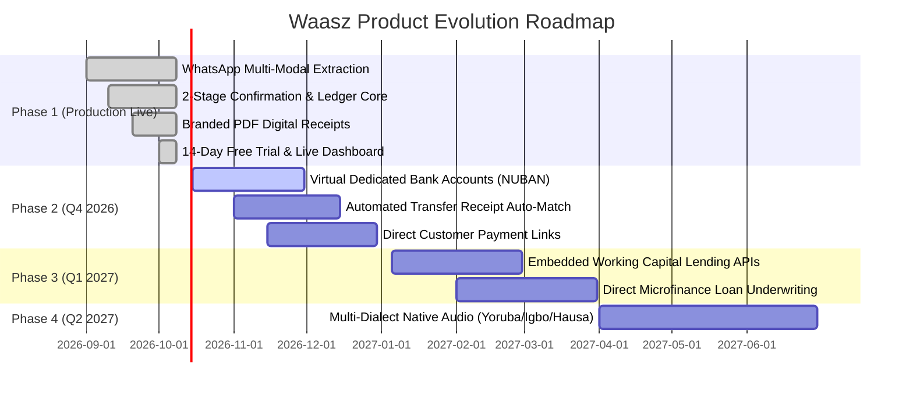

# Product Requirements Document (PRD)

**Product Name:** Waasz (WhatsApp AI Business Analyst & Smart Bookkeeping Operating System)  
**Document Version:** 1.0.0  
**Target Market:** Nigeria & Sub-Saharan Africa Micro, Small, and Medium Enterprises (MSMEs)  
**Status:** Approved / Active Production  
**Lead Product Team:** Waasz Engineering & Product Leadership  

---

## 1. Executive Summary

**Waasz** is a WhatsApp-native artificial intelligence business manager and financial operating system engineered specifically for informal micro, small, and medium enterprises (MSMEs) in emerging markets.

In Nigeria and across Sub-Saharan Africa, over **39.6 million MSMEs** generate nearly **50% of national GDP** and account for **96% of all businesses**. However, fewer than **5% have access to formal banking credit**, resulting in a devastating **$158B+ to $236B financing gap** (World Bank / IFC / SMEDAN). The root cause is not insolvency, but **information asymmetry**: informal merchants conduct business through oral transactions, paper notebooks, or mental tallies. Because they lack structured, verifiable records, formal financial institutions classify them as unbankable.

Previous standalone bookkeeping mobile applications (e.g., first-generation fintech apps) struggled with catastrophic 30-day user churn because they forced non-tech-savvy merchants to download heavy apps, consume scarce mobile data, and master complex double-entry accounting terminology (*debits, credits, ledgers*).

**Waasz breaks this adoption barrier by turning WhatsApp—the operating system African merchants already use every day—into an intelligent CFO.** Merchants simply send casual voice notes, text messages in English or Nigerian Pidgin (e.g., *"Sold 2 bags of sugar ₦30k"*), or pictures of receipts. Waasz's multi-agent AI cascade extracts the transaction, seeks single-tap interactive confirmation, writes it to an immutable double-entry ledger, generates branded PDF customer receipts, tracks debtor balances, delivers periodic profit-and-loss analytics with visual charts, and compiles audit-ready financial statements for loan and grant applications.

---

## 2. Problem Statement & Market Context

### 2.1 The Problem
1. **The Burden of Paper & Oral Record-Keeping:** Over 80% of informal retailers log sales in physical paper ledgers (*"ledger books"*) that are easily lost, stained, stolen, or damaged by moisture. When paper records vanish, business history and debt ledgers disappear with them.
2. **Customer Debt Bleed:** Informal retail thrives on short-term customer credit (*"buy now, pay on Friday"*). Without automated tracking and reminders, merchants lose an estimated **15% to 25% of monthly revenue** to forgotten or uncollected customer debts.
3. **The Credit & Loan Exclusion Trap:** When merchants apply for micro-loans from commercial banks, fintech lenders, or government intervention programs (such as SMEDAN / Bank of Industry credit guarantee funds), they are summarily rejected because they cannot produce 6 to 12 months of structured financial records.
4. **App Fatigue & Digital Friction:** Micro-retailers operate on low-storage Android smartphones and expensive cellular data. They routinely uninstall standalone apps within 7 to 14 days. Any solution requiring an app store download faces severe customer acquisition and retention headwinds.

### 2.2 Market Opportunity & Addressable Market
* **Total Addressable Market (TAM):** 39.6 million MSMEs in Nigeria; 90M+ across Sub-Saharan Africa.
* **Serviceable Addressable Market (SAM):** 18.2 million smartphone-enabled, WhatsApp-active commercial retailers, service providers, wholesalers, and artisans in urban and semi-urban commercial hubs (Lagos, Kano, Onitsha, Aba, Ibadan, Abuja, Port Harcourt).
* **Serviceable Obtainable Market (SOM):** 250,000 active MSMEs within 24 months, monetized at a blended ₦2,500 – ₦5,000 monthly subscription fee (yielding an ARR potential of ₦7.5B – ₦15B / ~$5M – ~$10M USD).

---

## 3. User Personas

### Persona A: The Fast-Paced Retail Trader ("Mama Ngozi")
* **Profile:** 46-year-old provision shop owner in Balogun Market, Lagos. High daily transaction volume (80–150 cash and bank transfer sales daily).
* **Pain Point:** Has no time to type during peak market hours. Writing in paper notebooks leads to forgotten sales and untracked customer balances.
* **Waasz Solution:** Records 5-second voice notes on WhatsApp (*"Sold 3 cartons of Indomie ₦24,000 to Iya Basira, she paid cash"*). Waasz logs it immediately and updates inventory and cash positions.

### Persona B: The Service Provider & Artisan ("Tunde")
* **Profile:** 29-year-old bespoke fashion designer in Ibadan. Employs 2 apprentices. Sells custom clothing across Nigeria via Instagram and WhatsApp.
* **Pain Point:** Customers demand instant receipts to trust online bank transfers. Lacks an invoicing system or computer. Struggles to calculate net profit after buying fabrics, thread, and generator fuel.
* **Waasz Solution:** Types *"Received ₦45,000 advance payment from Dr. Adeleke for 2 agbada"*. Waasz immediately replies with a professionally branded PDF receipt that Tunde forwards directly to the customer.

### Persona C: The Expanding Wholesaler ("Alhaji Garba")
* **Profile:** 52-year-old building materials and electrical wholesaler in Kano. Extends significant credit to sub-dealers and contractors.
* **Pain Point:** Millions of Naira tied up in receivables. Reconciling who owes what is a weekend-long headache. Needs formal records to apply for a ₦15M working capital bank loan.
* **Waasz Solution:** Checks debt positions anytime by texting *"Who owes me?"*. Generates bank-grade exportable 1-year P&L and cash flow statements to submit to credit officers.

---

## 4. Product Scope & Functional Requirements

```
+-----------------------------------------------------------------------------------+
|                                 WAASZ PLATFORM ARCHITECTURE                       |
+-----------------------------------------------------------------------------------+
|                                                                                   |
|  [ WhatsApp Client (Voice / Text / Photos) ]                                      |
|                       |                                                           |
|                       v                                                           |
|  [ Meta Cloud API Webhook Gateway (HMAC-SHA256 Signed) ]                          |
|                       |                                                           |
|                       v                                                           |
|  [ Multi-Provider AI Inference Engine ]                                            |
|    - Google Gemini 2.5 / Flash (Primary High-Context Extractor)                   |
|    - Groq LLaMA 3.3 70B (Sub-Second Fallback Extractor)                            |
|    - OpenAI (Dynamic Failover Guard)                                              |
|                       |                                                           |
|                       v                                                           |
|  [ Interactive Confirmation & Disambiguation Engine ]                             |
|    - 2-Button Interactive Reply ("1 Yes" / "2 Edit")                              |
|                       |                                                           |
|                       v                                                           |
|  [ Double-Entry Ledger & Business Operating Core ]                                 |
|    - Transactions (Sales, Expenses, Debts)                                        |
|    - Branded PDF Receipt Engine (ReportLab / Auto-Delivery)                       |
|    - Customer Debt Manager & Recovery Reminders                                   |
|    - Multi-Cadence Analytics (Daily, Weekly, Monthly, Yearly)                     |
|    - Google Drive Automated Sovereign Cloud Vault                                 |
|                       |                                                           |
|                       v                                                           |
|  [ PostgreSQL Storage Layer (JSONB, Async SQLAlchemy) ]                           |
|                       |                                                           |
|                       v                                                           |
|  [ Live Founder & Admin Telemetry Dashboard (Streamlit / Real-Time Sync) ]        |
|                                                                                   |
+-----------------------------------------------------------------------------------+
```

---

### Module 1: WhatsApp-Native Multimodal Ingestion
* **Req 1.1 — Multimodal Message Processing:** Accept text messages, WhatsApp voice audio notes (`.ogg` Opus), and photo images of physical receipts/invoices.
* **Req 1.2 — Colloquial & Pidgin NLP Resilience:** Correctly parse Nigerian business slang and currency abbreviations:
  * *"Sold 2 bags of rice ₦70k"* $\rightarrow$ Sale: 2 bags of rice @ ₦35,000, Total = ₦70,000.
  * *"Collected 15k from Emeka for yesterday debt"* $\rightarrow$ Debt Repayment: ₦15,000, Customer = Emeka.
  * *"Bought fuel ₦8,500 for generator"* $\rightarrow$ Expense: Fuel @ ₦8,500.
* **Req 1.3 — Voice Transcription:** Audio notes must be transcribed into clean conversational text in under 1.5 seconds using optimized speech-to-text models before AI entity extraction.

---

### Module 2: The Two-Stage Confirmation Gate (Zero Silent Corruption)
* **Req 2.1 — Draft Stage:** When an incoming message is processed, create a pending draft (`Confirmation` record) with calculated unit price, total amount, quantity, and transaction classification.
* **Req 2.2 — Interactive WhatsApp Buttons:** Respond to the user with an interactive WhatsApp button prompt:
  * Button 1: `✅ 1 Yes` (Confirms draft and commits to permanent ledger)
  * Button 2: `✏️ 2 Edit` (Allows merchant to correct amount or details)
* **Req 2.3 — Auto-Timeout & Idempotency:** Unconfirmed drafts expire automatically after 24 hours to prevent stale ledger pollution. Confirmed records are immutable and assigned a unique UUID.

---

### Module 3: Instant Branded Digital PDF Receipts
* **Req 3.1 — Automated Receipt Generation:** Whenever a sale is confirmed, generate a clean, professional, branded PDF receipt on the fly.
* **Req 3.2 — Custom Merchant Details:** Receipts dynamically include:
  * Merchant Business Name (e.g., *"Emeka Provisions & General Goods"*)
  * Store Address / Location
  * Bank Account Details (for direct customer transfers)
  * Unique Receipt Number (e.g., `REC-2026-XXXXX`)
  * Date, Timestamp, Itemized Quantities, Unit Prices, and Total
* **Req 3.3 — Instant WhatsApp In-Chat PDF Delivery:** The generated PDF is uploaded to Meta's media CDN and returned directly to the merchant's WhatsApp chat within 3 seconds, enabling 1-tap forwarding to customers.

---

### Module 4: Customer Debt Ledger & Credit Recovery
* **Req 4.1 — Debt Classification:** When a sale includes unpaid balances (`is_credit = True`), automatically create or update a `Customer` profile linked to the transaction.
* **Req 4.2 — Real-Time Receivables Lookup:** Merchants can text natural queries anytime:
  * *"Who is owing me?"* $\rightarrow$ Returns an itemized list of all customers, amounts owed, and overdue dates.
  * *"How much is Mama Bola owing?"* $\rightarrow$ Returns Mama Bola's ledger history and outstanding balance.
* **Req 4.3 — Friendly Payment Reminders:** Merchants can trigger one-tap polite debt reminder messages formatted for forwarding to customers on WhatsApp.

---

### Module 5: Multi-Cadence BI & Periodic Automated Reporting
* **Req 5.1 — Daily Evening Rollups (6:00 PM – 9:00 PM Local Time):** Automated dispatch summarizing:
  * Total Gross Sales Logged
  * Total Operating Expenses
  * Estimated Net Margin / Profit
  * Outstanding Receivables logged today
* **Req 5.2 — Weekly Unified Performance Report:** Sent every Sunday with growth insights, high-performing inventory items, and cash flow health indicators.
* **Req 5.3 — Visual Trend Charts:** Monthly, quarterly, and yearly reports automatically render and attach high-resolution graphical trend charts (Sales vs. Expenses vs. Net Profit) directly in chat.
* **Req 5.4 — Web Interactive Dashboard Magic Links:** Generate secure, expiring tokens granting the merchant temporary access to an interactive browser dashboard for in-depth data exploration.

---

### Module 6: Bank-Grade Loan & Audit Readiness Package
* **Req 6.1 — Structured Financial Export:** Merchants can request audit-ready exports anytime:
  * *"Send me my statement for loan application"* or *"Export last 6 months CSV"*.
* **Req 6.2 — Standard Accounting Framework:** Exports are formatted according to standard P&L and Cash Flow conventions:
  * Revenue breakdown by month and category
  * Operational expense breakdown (COGS, utilities, logistics)
  * Net operating margin and debt collection velocity
  * Verifiable transaction hashes for third-party verification by lenders and microfinance banks.

---

### Module 7: Data Privacy, NDPA Compliance & Sovereign Google Drive Vault
* **Req 7.1 — NDPA & Data Sovereignty:** In strict compliance with the **Nigeria Data Protection Act (NDPA)**, merchant data is never sold, leased, or utilized to train shared public models.
* **Req 7.2 — Automated Google Drive Mirroring:** Merchants can connect their personal Google Drive. On the 1st of every month, Waasz automatically compiles an encrypted PDF/CSV backup and uploads it directly to their private Drive folder. Merchants retain full ownership of their data even if they leave Waasz.

---

### Module 8: Multi-User Staff & Role-Based Permissions
* **Req 8.1 — Role Separation:** Support two distinct roles:
  * **Owner:** Full visibility into profit margins, account settings, debt ledgers, financial statements, and staff management.
  * **Staff / Apprentice:** Limited to recording daily sales and expenses, and issuing receipts. Blocked from viewing business profit margins, overall revenue, or sensitive owner reports.

---

### Module 9: 14-Day Free Trial & Monetization Lifecycle
* **Req 9.1 — Open Self-Service Onboarding:** No waitlists or manual admin approval. Any merchant clicking from the website is instantly activated on a **14-Day Free Trial**.
* **Req 9.2 — Interactive Setup Wizard:**
  * Step 1: Welcome message explaining NDPA privacy and free trial activation $\rightarrow$ asks for Shop Name.
  * Step 2: On receipt of shop name $\rightarrow$ prompts for Store Address and Bank Account details for customer receipts (or "Skip").
  * Step 3: Immediate readiness $\rightarrow$ merchant can start texting transactions immediately.
* **Req 9.3 — Week 1 Review & Feedback Check-In:** At the end of Week 1 (following their first weekly report), automated prompt requests a 1–5 star rating and feature suggestions, storing responses in the database.
* **Req 9.4 — Day 14 Trial Completion Notice:** Automated scheduler calculates total sales and transactions recorded over the trial period, delivers a congratulatory summary, and presents monthly subscription options.

---

### Module 10: Real-Time Founder & Operations Telemetry Dashboard
* **Req 10.1 — Live Sync (No Hardcoding):** Powered by Streamlit (`admin/streamlit_app.py`) querying PostgreSQL with a 5-second cache and live 10-second polling.
* **Req 10.2 — Live KPI Metrics:**
  * Active Registered Businesses
  * 24h Inbound & Outbound WhatsApp Traffic
  * Confirmed Transactions in Last 24 Hours
  * Pending Confirmations Awaiting User Action
  * Real-Time AI API Spend ($ USD tracked per token event)
* **Req 10.3 — Live Trial & Onboarding Tracker Table:**
  * Merchant Name, Phone Number, Joined Date
  * Real-Time Trial Status (e.g., `🟢 Day 3 of 14 (11d left)` or `⚠️ Expired`)
  * Current Onboarding Stage (`📝 Awaiting Shop Name`, `🧾 Awaiting Receipt Setup`, `✅ Active`)
  * Total Transactions Logged & Total Sales Recorded (₦)
  * Week 1 Review Rating (⭐ 1–5) and verbatim customer feedback
* **Req 10.4 — Operations Controls:** Direct WhatsApp broadcast tools, capacity management sliders, access strategy switcher (`open`, `invite_code`, `allowlist`), and account recovery tools.

---

## 5. Non-Functional Requirements (NFRs)

| Category | Requirement | Target Metric |
| :--- | :--- | :--- |
| **Latency** | End-to-end response time from user WhatsApp send to bot reply | $< 2.5\text{ seconds}$ (95th percentile) |
| **Availability** | System uptime and webhook listener availability | $\ge 99.9\%$ monthly availability |
| **Resilience** | AI provider failover cascade (Gemini $\rightarrow$ Groq $\rightarrow$ OpenAI) | Zero dropped user messages on primary provider rate limit |
| **Security** | Meta Webhook Signature Verification | 100% of incoming payloads verified via `X-Hub-Signature-256` |
| **Data Protection** | Encryption in transit and at rest | TLS 1.3 in transit; AES-256 encrypted database volumes |
| **Scalability** | Concurrent transaction volume capacity | 5,000 concurrent active chat sessions per worker cluster |

---

## 6. Success Metrics & Key Performance Indicators (KPIs)

```
                     +---------------------------------------+
                     |         NORTH STAR METRIC:            |
                     |  Total Verified Merchant Sales Volume  |
                     |       Logged & Reconciled (NGN)       |
                     +---------------------------------------+
                                         |
         +-------------------------------+-------------------------------+
         |                               |                               |
         v                               v                               v
[ Acquisition & Onboarding ]     [ Engagement & Retention ]      [ Monetization & Unit Econ ]
- Time-to-First-Sale < 60s      - 30-Day Active Retention > 45% - Free-to-Paid Conversion > 12%
- Onboarding Completion > 85%   - Confirmed Tx / User / Week > 8 - AI Inference Cost < $0.15/user/mo
```

### 6.1 Product Adoption & Usability KPIs
* **Time-to-First-Transaction:** Median time from first WhatsApp message to first confirmed transaction $< 60\text{ seconds}$.
* **Onboarding Completion Rate:** $\ge 85\%$ of new visitors complete business name and receipt configuration.
* **Confirmation Accuracy:** $\ge 96\%$ of AI-generated transaction drafts confirmed with `"1 Yes"` without edits.

### 6.2 Financial & Economic Impact KPIs
* **Debt Recovery Velocity:** $\ge 30\%$ increase in on-time customer debt collection reported by active merchants.
* **Loan Application Success Rate:** $\ge 40\%$ approval rate for merchants using Waasz-generated audit statements when applying to microfinance and SMEDAN-backed programs.

---

## 7. Product Release Plan & Roadmap



### Phase 1: Core Financial Management (Current Live Production)
* WhatsApp conversational extraction (text, voice, receipt photos).
* Two-stage interactive confirmation gate and immutable double-entry ledger.
* Branded PDF receipt generation and in-chat delivery.
* Customer debt tracking and payment reconciliation.
* 14-Day Free Trial self-service onboarding and live founder telemetry dashboard.

### Phase 2: Embedded Banking & Automated Bank Transfer Matching (Next)
* **Virtual Dedicated Accounts (NUBAN):** Partner with licensed Payment Service Banks (PSBs) to assign dedicated virtual bank accounts to each merchant.
* **Instant Bank Transfer Matching:** When a customer transfers money to the merchant's account, Waasz receives instant webhook notification from the bank, reconciles it against open orders or debt ledgers, and logs the sale automatically without merchant input.

### Phase 3: Embedded Credit Scoring & Lending Partnerships
* **Alternative Credit Scoring Engine:** Package anonymized, verified cash flow history into standardized risk scores.
* **Direct Micro-Lending in WhatsApp:** Pre-approve merchants for ₦50,000 – ₦1,000,000 inventory working capital loans directly inside their WhatsApp chat, backed by institutional lending partners and SMEDAN credit guarantees.

### Phase 4: Native Language Speech-to-Text Localization
* Integrate fine-tuned African language speech models supporting native **Yoruba, Hausa, and Igbo** dialects for rural and non-English-literate market traders.

---

## 8. Regulatory & Compliance Framework

1. **Nigeria Data Protection Act (NDPA 2023):**
   * Transparent data consent gathered during onboarding.
   * Right to erasure supported via in-chat command or admin dashboard deletion.
   * Merchant business data encrypted with AES-256 and segregated per business ID.
2. **Meta WhatsApp Business Policy:**
   * Full adherence to Meta Commerce and WhatsApp Business Messaging guidelines.
   * 24-hour customer care window compliance; utility-approved templates utilized for outbound scheduled reports outside active conversation sessions.
3. **Financial Regulatory Compliance:**
   * Waasz operates as a pure technology and bookkeeping software layer. It does not hold customer deposits directly, relying on licensed CBN financial institutions for any underlying banking integrations.

---

*Document approved by Waasz Product & Engineering Leadership.*
