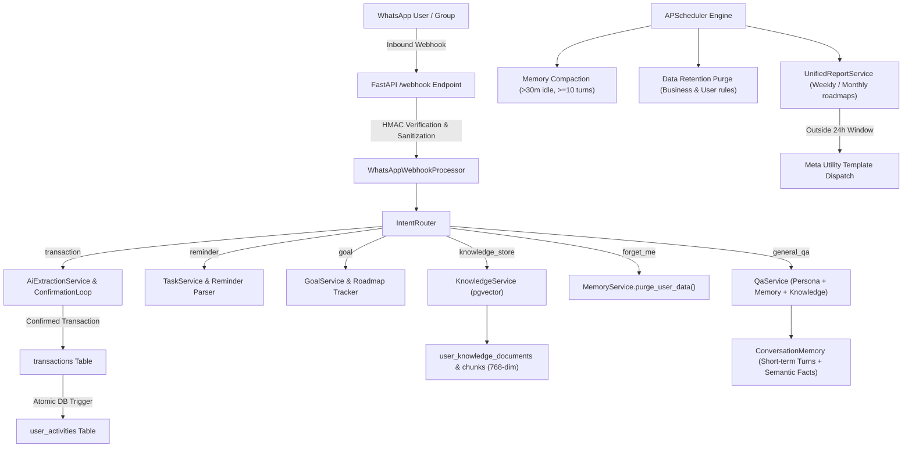

# Architecture & System Design: Generalized Multi-Tenant WhatsApp Assistant

The platform is an enterprise-grade, multi-tenant WhatsApp AI assistant designed to serve multiple user personas (SME Owners, 9-to-5 Employees, Freelancers, Students, and Personal Productivity) while maintaining strict tenant isolation, budget predictability, and full backwards compatibility with double-entry SME sales/inventory ledgers.

---

## 1. High-Level Architecture Flow

---

## 2. Multi-Tenant Scoping & Strict SQL-Level Isolation

- **Connection Role Note**: The FastAPI backend connects to PostgreSQL via `DATABASE_URL` as a superuser/owner role (`postgres`), which possesses `BYPASSRLS`. Therefore, **Row Level Security (RLS) policies serve as defense-in-depth**, while tenant isolation is strictly enforced in the application layer via **mandatory parameterized SQL `WHERE` clauses** and verified by automated negative isolation tests in CI.
- **Shared Business vs Private Isolation**:
  - `user_goals` and `user_activities` include a `visibility` column (`'private'` vs `'business_shared'`).
  - `user_knowledge_documents` and `user_knowledge_chunks` include `business_id` and `visibility`:
    - Personal users (students, freelancers) are strictly scoped with `WHERE user_id = :user_id`.
    - Business staff can search price lists and catalogs with `WHERE ((user_id = :user_id) OR (business_id = :business_id AND visibility = 'business_shared'))`.
    - Server-side verification confirms `user_id` belongs to `business_id`; forged/mismatched requests raise a `SecurityError`.

---

## 3. Two-Tier Memory & Knowledge System

1. **Short-Term Context**: Rolling buffer of recent conversation turns from `whatsapp_messages`.
2. **Long-Term Semantic Memory**: `conversation_memories` table with 768-dimensional embeddings (`text-embedding-004`).
3. **Background Compaction**: Schedulable job runs every 15 minutes, finding users idle for 30+ minutes with 10+ uncompacted turns and summarizing them into durable facts.
4. **Right-to-be-Forgotten**: Compliant with NDPR/GDPR. User sends `"forget me"` -> replies `"CONFIRM DELETE"` -> atomically deletes all memories, knowledge chunks, goals, activities, and messages.

---

## 4. Cost Governance & Throttling Semantics

- **Per-User Hard Cap**: $0.50/day per user. Any runaway user is individually throttled without impacting other users.
- **Systemic Dynamic Ceiling**: `max(10.0, active_users * 0.50 * 1.25)` USD.
  - The 1.25x headroom multiplier guarantees that legitimate concurrent users operating within their $0.50 limit are **never** blocked by the global ceiling.
  - **Soft Alert (80%)**: Emits high-priority monitoring logs and alerts.
  - **Circuit Breaker (100%)**: Trips hard shutoff for cloud LLM calls, safely failing over to the deterministic local keyword parser (`local_extraction_fallback`).
- **Projected Unit Cost**: < $0.02 USD per active user per month.

---

## 5. Group Messaging Readiness & Meta OBA Gating

- WhatsApp Cloud API requires Meta **Official Business Account (OBA)** status for group messaging and limits groups to 8 members.
- `settings.enable_group_messaging` defaults to `False`.
- `GroupChatHandler.is_group_messaging_active()` verifies both the configuration flag AND queries Meta Graph API (`verify_waba_oba_status()`). It remains inactive until live OBA status is confirmed.
- When active, only messages explicitly mentioning `@assistant` or `@bot` are processed, and personal private 1-on-1 memories are never retrieved or leaked into group responses.
